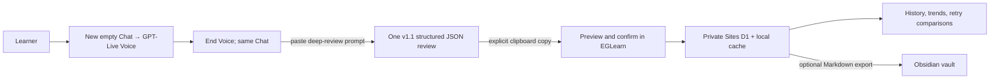

# EGLearn architecture

## Product decision

The default speaking surface is ordinary Chat in the ChatGPT desktop app, started directly in Voice so the conversation uses GPT-Live. EGLearn supplies the spoken session marker, live checkpoint guidance, the complete post-Voice review prompt, and the private record system. It does not proxy the OpenAI API.

## Why this is the shortest reliable GPT-Live path

- The learner stays in ChatGPT for the live conversation instead of opening a second recorder.
- A ChatGPT Voice conversation must begin as a new, empty voice chat. Sending a long text bootstrap first would start a text-first chat and offer dictation instead of the intended live conversation.
- The short coaching instruction is therefore spoken after Voice starts. The long v1.1 review contract is pasted only after Voice ends, when text is appropriate.
- Ordinary Chat does not load EGLearn's private plugin, Action, or repository files. The complete post-Voice prompt must be self-contained.
- The dashboard handles durable records, recurring-error aggregation, retry comparisons, and optional Obsidian export without an OpenAI API key.

## Default session boundary

1. Create a new, empty Chat in the ChatGPT desktop app.
2. Select **Start new voice chat** before sending any message.
3. Read the short starter beginning with `EGLearn session starts now`.
4. Practise in English. GPT-Live may make at most five short, labelled `[EGLearn live checkpoint]` messages when it directly hears pronunciation, fluency, naturalness, or grammar feedback; repeat once and continue. Before ending, it gives a labelled `[EGLearn oral recap]` so the observations remain in the Chat transcript.
5. Paste the complete review prompt into the same Chat.
6. Copy the single JSON block, import it into EGLearn, preview the quoted evidence, and confirm the save.

`lib/chat-live-prompts.mjs` is the single source for the spoken starter and complete review prompt. The prompt derives the controlled rule IDs and exact no-assessment reasons from the same review-contract module used by the dashboard parser.

The post-Voice transcript may not be verbatim, and a normal ChatGPT conversation does not promise a separate raw-audio file or word-level timing feed for EGLearn. Consequently the review has two explicit tracks:

- transcript evidence drives the full language review: 3–8 segments, up to 12 unique issues, strengths, useful expressions, and retry drills;
- `oralAnalysis` can use direct Voice evidence only when the same Chat context genuinely exposes it, or when a labelled checkpoint/recap was written into the Chat transcript (`evidenceMode=live_checkpoint`);
- transcript-only reviews must set `evidenceMode=not_available` and leave pronunciation and fluency unassessed;
- no review may infer accent, phonemes, connected speech, WPM, pause seconds, speaking duration, or an audio score from text;
- every language correction cites a learner utterance; Voice checkpoint text is not learner evidence;
- recurrence counts come from stored records, not model memory.

The importer performs structural validation: it verifies that quotes exist and that scores and classifications obey the contract. Because the dashboard does not receive an independently trusted transcript, it cannot prove that a quote is verbatim. The learner previews the evidence before saving.

## Components

### Chat + GPT-Live launcher

`app/chat-live-launcher.tsx` shows the required order, the spoken marker, and a one-click copy button for the complete review prompt. Clipboard failures reveal a selectable manual-copy field. The UI deliberately does not auto-open or inject text into ChatGPT, and it warns against sending text before Voice starts.

### Review importer and dashboard

`app/review-dashboard.tsx` can read the copied JSON from the clipboard after an explicit click, or accept a manual paste. Both paths pass through `parseReviewText`; input over 64 KiB is rejected. The learner previews the quoted evidence, segment cards, full issue list, and oral evidence boundary before confirming.

The browser then saves the normalized review through the authenticated same-origin `/api/sessions` route. The server generates record IDs and timestamps and stores the review in Sites D1. IndexedDB remains an offline cache. Cloud and local copies are merged by normalized review content before progress aggregation.

Cross-session aggregation uses only controlled `ruleId` values. One distinct session is new, two to three are repeated, and four or more are frequent; `OTHER` is never aggregated. Score charts retain the original 1–5 practice bands and omit unassessed points. A missing error is not treated as success because the system does not record whether the learner had a real opportunity to use the target structure.

### Optional legacy Custom GPT + Action path

`gpt/` and `/api/actions/reviews` retain the previously deployed private Custom GPT + Action integration as an optional compatibility path. It is not required or invoked by the default Chat + GPT-Live workflow. Its single-owner credential remains private in Sites/GPT Builder; publishing the configured GPT would still require per-user OAuth and owner-isolated rows.

### Obsidian export

Each session renders to a stable, timezone-aware Markdown filename with typed YAML properties, a hashed managed region, a permanent `My notes` section, segment drills, and any direct oral observations. Download and copy are the primary paths. The optional `obsidian://new` shortcut copies the Markdown first and requests creation; it never appends to or overwrites an existing note. EGLearn remains the authoritative data store.

## Security guardrails

- No OpenAI credential is required anywhere in the default architecture.
- The Chat prompt contains no API host, token, bearer value, or user identity.
- Chat/Voice content stays in ChatGPT; only the user-copied structured review enters EGLearn.
- Browser history, save, and deletion routes require the authenticated private Sites user.
- The retained Action exposes one write operation and its credential remains outside source, logs, screenshots, and request bodies.
- `.env*`, `.dev.vars*`, private keys, keystores, and common credential files are ignored.
- `npm run check:secrets` scans tracked and untracked repository files before push.
- `.githooks/pre-push` blocks a push when the scanner finds likely credentials.

## Sources for current platform boundaries

- [ChatGPT Voice](https://learn.chatgpt.com/docs/features/voice)
- [ChatGPT plugins](https://learn.chatgpt.com/docs/plugins#overview)
- [ChatGPT Plus](https://help.openai.com/en/articles/6950777-what-is-chatgpt-plus)
