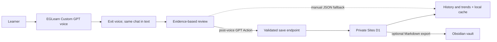

# EGLearn architecture

## Product decision

ChatGPT Plus is the speaking interface. EGLearn adds a Custom GPT workflow and a focused record system; it does not proxy the OpenAI API.

## Why this is the shortest valid path

- The learner stays in ChatGPT for the live conversation instead of opening a second recorder.
- There is no OpenAI API key, separate OpenAI billing account, or custom speech stack.
- The dashboard does work ChatGPT chat history is poor at: stable records, recurring-error aggregation, and retry comparisons.
- Obsidian remains optional. First-time users do not need to install a plugin or configure a vault.

## Honest product boundaries

ChatGPT Plus does not grant OpenAI API quota. This project must never ask for or store an OpenAI API key.

Custom GPT Actions, Apps, MCP servers, and plugins are unavailable during a voice conversation. The supported flow is:

1. Practice in the EGLearn Custom GPT using voice mode.
2. Exit voice mode while staying in the same conversation.
3. Send `生成复盘` in text.
4. Send `复盘并保存` in text. The GPT calls the Action only after voice mode has ended.
5. If the Action does not confirm success, use `生成复盘` and the manual JSON importer.

The post-voice transcript may not be verbatim. The GPT must not claim access to raw audio or precise timing. Consequently:

- pronunciation is not assessed from text;
- fluency is unassessed without timing evidence;
- speaking duration is omitted or clearly labeled as an estimate without timestamps;
- every correction cites a learner utterance;
- recurrence counts come from stored records, not model memory.

The MVP importer performs structural validation: it verifies that quotes exist and that scores and classifications obey the contract. Because the dashboard does not receive an independently trusted transcript, it cannot prove that a quote is a verbatim learner utterance. The UI must present quotes as GPT-supplied and leave them easy for the learner to compare with the chat. True source validation would require importing the learner transcript as a separate input and checking exact substrings, which is intentionally deferred to avoid extra copy steps.

## Components

### Custom GPT and Action

`gpt/` contains the versioned instructions, knowledge, generated OpenAPI schema, setup guide, and evals copied into ChatGPT's GPT builder. The GPT controls the teaching interaction and review protocol. `saveSpeakingReview` is the only Action operation and accepts only an idempotency key plus the strict v1.0 review object. It never receives raw audio, a full transcript, a user identity, a timestamp, or a credential in the payload.

The personal MVP keeps both the Site and GPT private. GPT Builder stores a Sites identity-bypass bearer value as an encrypted custom-header credential. That value is not an OpenAI API key and never belongs in Git. The Action credential represents the single private owner; sharing or publishing the GPT requires replacing it with per-user OAuth first.

### Web dashboard

The vinext/React app and Action route reuse the same strict Zod review contract. The server generates record IDs and timestamps, uses an idempotency key to prevent duplicate Action retries, and stores normalized JSON in Sites D1. Browser routes require the authenticated Sites user; the current Sites access policy is owner-only. IndexedDB remains an offline cache and manual fallback. Cloud and local copies are merged by normalized review content before progress aggregation.

Cross-session aggregation uses only controlled `ruleId` values. One distinct session is new, two to three are repeated, and four or more are frequent; `OTHER` is never aggregated. Score charts retain the original 1–5 practice bands and omit unassessed points. A missing error is not treated as success because the system does not yet record whether the learner had a real opportunity to use the target structure.

### Obsidian export

Each session renders to a stable, timezone-aware Markdown filename with typed YAML properties, a hashed managed region, and a permanent `My notes` section. Download and copy are the primary paths. The optional `obsidian://new` shortcut copies the Markdown first and requests creation through the `clipboard` flag; it never uses `append`, `overwrite`, or `silent`. The UI says the request was sent and asks the user to confirm in Obsidian rather than claiming sync success. EGLearn remains the authoritative data store.

## Security guardrails

- No OpenAI credential is required anywhere in the architecture.
- The private Sites identity-bypass value is stored only in Sites/GPT Builder configuration and never in source, logs, screenshots, or request bodies.
- The Action exposes one write operation; browser history and deletion routes still require the authenticated Sites user.
- `.env*`, `.dev.vars*`, private keys, keystores, and common credential files are ignored.
- `npm run check:secrets` scans tracked and untracked repository files before push.
- `.githooks/pre-push` blocks a push when the scanner finds likely credentials.
- Secrets must never appear in test fixtures, example logs, screenshots, Markdown, or Git history.

## Sources for current platform boundaries

- [ChatGPT Plus](https://help.openai.com/en/articles/6950777-what-is-chatgpt-plus)
- [ChatGPT Voice](https://help.openai.com/en/articles/20001274-chatgpt-voice)
- [GPTs in ChatGPT](https://help.openai.com/en/articles/8554407-gpts-in-chatgpt)
- [Configuring GPT Actions](https://help.openai.com/en/articles/9442513)
