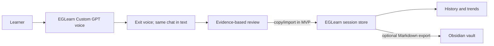

# EGLearn architecture

## Product decision

ChatGPT Plus is the speaking interface. EGLearn adds a Custom GPT workflow and a focused record system; it does not proxy the OpenAI API.

## Why this is the shortest valid path

- The learner stays in ChatGPT for the live conversation instead of opening a second recorder.
- There is no API key, separate OpenAI billing account, or custom speech stack.
- The dashboard does work ChatGPT chat history is poor at: stable records, recurring-error aggregation, and retry comparisons.
- Obsidian remains optional. First-time users do not need to install a plugin or configure a vault.

## Honest product boundaries

ChatGPT Plus does not grant OpenAI API quota. This project must never ask for or store an OpenAI API key.

Custom GPT Actions, Apps, MCP servers, and plugins are unavailable during a voice conversation. The supported flow is:

1. Practice in the EGLearn Custom GPT using voice mode.
2. Exit voice mode while staying in the same conversation.
3. Send `生成复盘` in text.
4. Copy/import the structured review into EGLearn.

The post-voice transcript may not be verbatim. The GPT must not claim access to raw audio or precise timing. Consequently:

- pronunciation is not assessed from text;
- fluency is unassessed without timing evidence;
- speaking duration is omitted or clearly labeled as an estimate without timestamps;
- every correction cites a learner utterance;
- recurrence counts come from stored records, not model memory.

The MVP importer performs structural validation: it verifies that quotes exist and that scores and classifications obey the contract. Because the dashboard does not receive an independently trusted transcript, it cannot prove that a quote is a verbatim learner utterance. The UI must present quotes as GPT-supplied and leave them easy for the learner to compare with the chat. True source validation would require importing the learner transcript as a separate input and checking exact substrings, which is intentionally deferred to avoid extra copy steps.

## Components

### Custom GPT

`gpt/` contains the versioned instructions and knowledge files copied into ChatGPT's GPT builder. The GPT controls the teaching interaction and review protocol. A later Action may save reviews after voice mode ends, but the MVP deliberately uses copy/import first so the core habit can be tested without OAuth or a server dependency.

### Web dashboard

The vinext/React app imports and structurally validates reviews, assigns a sortable local session ID and import timestamp, and persists the result in IndexedDB. It presents session history without login or server writes. Issue trends and retry comparisons build on the same records. A later version may use Sites D1 and ChatGPT workspace identity if cross-device sync proves necessary.

Cross-session aggregation uses only controlled `ruleId` values. One distinct session is new, two to three are repeated, and four or more are frequent; `OTHER` is never aggregated. Score charts retain the original 1–5 practice bands and omit unassessed points. A missing error is not treated as success because the system does not yet record whether the learner had a real opportunity to use the target structure.

### Obsidian export

The first implementation will render one stable Markdown file per session and support download/copy. An `obsidian://new` shortcut may be offered as a convenience, but the UI must say “requested Obsidian to create” rather than “synced”. EGLearn remains the authoritative data store.

## Security guardrails

- No OpenAI credential is required anywhere in the architecture.
- `.env*`, `.dev.vars*`, private keys, keystores, and common credential files are ignored.
- `npm run check:secrets` scans tracked and untracked repository files before push.
- `.githooks/pre-push` blocks a push when the scanner finds likely credentials.
- Secrets must never appear in test fixtures, example logs, screenshots, Markdown, or Git history.

## Sources for current platform boundaries

- [ChatGPT Plus](https://help.openai.com/en/articles/6950777-what-is-chatgpt-plus)
- [ChatGPT Voice](https://help.openai.com/en/articles/20001274-chatgpt-voice)
- [GPTs in ChatGPT](https://help.openai.com/en/articles/8554407-gpts-in-chatgpt)
- [Configuring GPT Actions](https://help.openai.com/en/articles/9442513)
